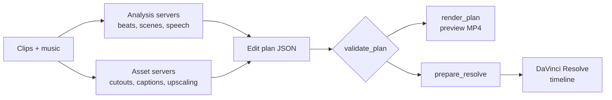

# Framewright

**Let an AI do the tedious part of a video edit: beat-syncing, cutouts, captions. Then finish the cut yourself in DaVinci Resolve.**

19 MCP servers · 45 tools · 380+ tests

https://github.com/user-attachments/assets/65e602e1-29ac-44b7-8c3b-12e2115fe5ca

Framewright is a set of small Python tools that any AI agent with **Model Context Protocol (MCP)** support can call. They listen to the music, find the shots, transcribe speech and cut out subjects. The agent then turns those results into an edit plan and a DaVinci Resolve script that builds the timeline. Use an MCP-capable agent app backed by a capable hosted model through your own API key or subscription; small local models can't write reliable Resolve scripts and aren't supported.

---

## Why it exists

- Most of an edit's hours go to mechanical work: finding beats, lining cuts up to them, rotoscoping, typing captions.
- AI video generators replace the editor; Framewright keeps the editor and removes the busywork.
- **For editors who want an AI to do the tedious 80% (beat-syncing, cutouts, captions) while keeping the final cut in Resolve.**

---

## What it can do

| Area | Highlights |
|---|---|
| Analysis | Beats, downbeats, song sections, impacts, local speech-to-text with word timestamps, shot detection, audio-based highlight picking |
| Assets | Frame extraction, Real-ESRGAN upscaling, subject cutouts (ISNet for anime, U2-Net for general, opt-in BiRefNet-lite `general_hq` for sharper hair/edges), chroma key, animated titles, karaoke captions |
| Render | Editing effects and xfade transitions, 7 cinematic LUTs, color matching, film-look overlays, speed ramps, stabilization, Ken Burns, compositing, loudness/ducking, platform export presets |
| Plans | Draft (`build_edit_plan`, `auto_amv_plan`), check (`validate_plan`), preview (`render_plan`), send to Resolve (`prepare_resolve`) |
| Resolve | 90 Fusion templates (titles, effects, transitions, generators) and 21 Lua scripts; all work in the free edition |

Model-based tools take `style="anime" | "general"`, so both animation and live-action footage work. Every server and tool: [docs/README.md](docs/README.md).

---

## Requirements

| Need | Notes |
|---|---|
| OS | Windows, Linux or macOS |
| Python | 3.10+ (managed by `uv`) |
| [uv](https://docs.astral.sh/uv/) | installs the workspace |
| ffmpeg + ffprobe | on PATH |
| GPU (optional) | NVIDIA for faster subject cutouts; Vulkan for Real-ESRGAN upscaling |
| Disk | ~0.5 GB for models (`scripts/fetch_models.py`), more with `birefnet` |
| DaVinci Resolve (optional) | free edition is enough; without it, use `render_plan` and the render servers |

## Quick start

1. Install `ffmpeg` and `uv`.
2. Run setup. It installs every server, downloads models, creates `.mcp.json` and runs a smoke test:
   - Windows: `powershell -ExecutionPolicy Bypass -File scripts\setup.ps1`
   - Linux/macOS: `bash scripts/setup.sh`
3. Open an AI agent app that supports MCP, sign in or add your model API key, and load the servers from `.mcp.json`. The agent should now list the Framewright tools.
4. Ask it for a first edit, for example:

   > Detect the beats in `input/song.mp3`, cut the clips in `input/clips/` to them, validate the plan and render a preview.

   It calls `detect_beats`, `build_edit_plan`, `validate_plan` and `render_plan`, and writes the plan JSON and a preview MP4 to `output/`. Run `prepare_resolve` next to build the same edit in Resolve.

Details: [docs/setup.md](docs/setup.md). CPU-only check without installing anything locally: `docker build -t framewright . && docker run --rm framewright` (starts all 19 servers and lists their tools).

---

## How it works



**Design decisions** (more in [docs/architecture.md](docs/architecture.md)):

- **Many small servers, not one big one.** Each has its own dependencies, so the heavy ones (torch, ONNX, Whisper) only install where needed.
- **The edit plan is the contract.** A JSON file the AI agent, the validator, the previewer and Resolve all read, so each step can be checked on its own.
- **Resolve stays in charge of the final cut.** Tools prepare media; the editor finishes by hand.
- **Frame-exact cuts.** Cuts are snapped to frames, then to detected onsets, so they land on the beat.

Why each choice was made: [docs/decisions/](docs/decisions/README.md).

---

## Results

Measured on synthetic, license-free fixtures with known ground truth (`evals/`). The numbers compare tools and catch regressions; they are not claims about every kind of footage. CI fails if beat-sync or scene results regress.

| Eval | Metric | Result |
|---|---|---|
| Beat-synced cuts (90/120/140 BPM, 25 fps) | cuts > 1 frame off the beat | **0 / 114** (was 89 / 114); mean error ≈ 10 ms, worst 26 ms |
| Beat detection | F-measure (mir_eval, ±70 ms) | 1.000 / 0.987 / 1.000 |
| Scene cuts (5 hard cuts) | precision / recall | 1.000 / 1.000 |
| Scene cuts, hard set (2 dissolves, 3 hard cuts incl. near-identical greys) | precision / recall | 1.000 / 0.600 (not a CI gate) |
| Transcription (Whisper base, CPU) | word error rate | 0.026 |
| Subject cut-out, anime set (20 frames) | mean IoU: anime model / general model | 0.604 / 0.528 |
| Subject cut-out, live-action set (20 frames) | mean IoU: general model / anime model | 0.762 / 0.437 |

How 89/114 became 0/114: [docs/case-study-beat-sync.md](docs/case-study-beat-sync.md).

Reproduce (needs ffmpeg; each eval runs in the server it tests):

```bash
python scripts/run_evals.py        # beat-sync + scenes
python scripts/run_evals.py all    # + beat F-measure, WER, segmentation
```

### Performance

Seconds of processing per minute of 1080p footage at 24 fps (lower is better). Measured on a laptop with a Ryzen 9 8940HX and an RTX 5050 Laptop GPU, on a short synthetic clip, so treat these as rough numbers.

| Tool | GPU | CPU |
|---|---|---|
| Subject cut-out, `anime` (ISNet) | 338 | 969 |
| Subject cut-out, `general` (U2-Net) | 231 | 455 |
| Subject cut-out, `general_hq` (BiRefNet lite) | 1475 | 7904 |
| Whisper base transcription (per minute of audio) | 2 | 6 |
| Real-ESRGAN x2, `realesr-animevideov3` (Vulkan) | 9674 (includes model load) | - |
| Stabilization (vid.stab, two passes) | - | 80 |

Run it on your machine: `uv run python scripts/benchmark.py --frames 48`.

---

## Limitations

- Subject cutouts on macOS run on CPU only.
- Real-ESRGAN upscaling needs a Vulkan-capable GPU.
- Anime cutout IoU is 0.60 on synthetic frames; expect touch-ups on hard shots.
- `general_hq` (BiRefNet) is slow: about 7 s per frame on CPU.
- The free edition of Resolve has no live remote control; you run the generated script from Resolve's Scripts menu.
- Scene detection misses dissolves and near-identical shots (recall 0.60 on the hard set).

## Roadmap

Planned work is tracked in [GitHub issues](https://github.com/nishanthsr7-eng/framewright/issues).

---

## Layout

```
servers/core/       framewright_core: shared ffmpeg, probe, paths, error helpers
servers/*/tests/    Per-server unit and ffmpeg integration tests
tests/              Cross-server, plan, Resolve script and template tests
servers/analysis/   audio_analyzer, scene_detector, beat_sync, highlight_reel
servers/assets/     frame_extractor, subject_extractor, chroma_key, text_overlay
servers/render/     effects, lut_grading, color_match, compositor, overlay_fx, speed_ramp,
                    stabilization, ken_burns, audio_mastering, export_presets, timeline_project
resolve/            Lua scripts, Fusion templates, bridge/ (helpers for generated scripts)
prompts/            Prompt templates for the AI agent
examples/           Example edit plans
demos/              Worked examples
evals/              Synthetic fixtures and accuracy evals
scripts/            Setup, model download, smoke test, eval runner
docs/               Documentation
models/             Model weights (downloaded, not in git)
```

**Original vs vendored:** `servers/assets/frame_extractor` is vendored from [video-creator/ffmpeg-mcp](https://github.com/video-creator/ffmpeg-mcp) (MIT); its README lists what changed. Everything else is original to this repo.

---

## Docs

- [Setup](docs/setup.md): install, models, MCP client config
- [Workflow](docs/workflow.md): from raw clips to a Resolve timeline
- [Architecture](docs/architecture.md): how the pieces fit
- [Edit plan](docs/edit-plan.md): the JSON format the AI agent works from
- [DaVinci Resolve](docs/resolve.md): templates, scripts, install
- [Servers](docs/README.md): every server and tool
- [Third-party](docs/third-party.md): vendored code, models, fonts
- [Credits](CREDITS.md): demo footage and music

## Contributing

Lint and test before a PR:

```bash
uv run --only-group dev ruff check . && uv run --only-group dev ruff format --check .
uv run --only-group test pytest
```

How to add a server, code rules and tests: [CONTRIBUTING.md](CONTRIBUTING.md). Security reports and why to read generated scripts first: [SECURITY.md](SECURITY.md). Community guidelines: [CODE_OF_CONDUCT.md](CODE_OF_CONDUCT.md). Release history: [CHANGELOG.md](CHANGELOG.md).

## License and credits

MIT, see [LICENSE](LICENSE). Vendored code, models, fonts and demo media keep their own licenses; see [CREDITS.md](CREDITS.md).
