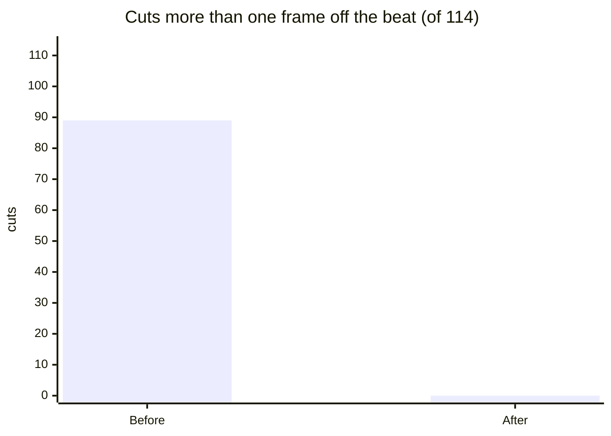

# Case study: from 89/114 to 0/114 off-beat cuts

## The problem the evals found

`evals/eval_beat_sync.py` renders a beat-synced video from two solid-colour clips (red, blue) over click tracks at 90, 120 and 140 BPM, 25 fps. Every cut is a colour flip, so the cut frame can be found exactly and compared with the known beat times in `evals/fixtures/ground_truth.json`.

The first run: **89 of 114 cuts landed more than one frame (40 ms) off the beat.** By ear the edits had seemed fine; the numbers said otherwise.

## Two causes

1. **Rounding drift.** Segment lengths were computed as `diff(cut_times)` in seconds, and each segment was encoded separately. ffmpeg rounds each segment to whole frames, so every segment gained or lost up to half a frame, and the error added up along the timeline. Late cuts drifted the most.
2. **Coarse beat times.** `librosa.beat.beat_track` reports beats on its analysis-frame grid (512-sample hop, ~23 ms at 22.05 kHz) and the tracker can place a beat slightly before or after the actual transient.

## The fix

1. **Snap absolute cut times to frames, then derive lengths** (`beat_sync.py`):
   ```python
   cut_frames = np.unique(np.round(cut_times * fps).astype(int))
   segment_frames = np.diff(cut_frames)
   ```
   Each cut is rounded once, against the timeline origin, so error can't build up. The worst case is half a frame, at any point in the song.
2. **Onset refinement** (`_refine_to_onsets`): each tracked beat moves to the nearest onset within ±70 ms, found on a fine 128-sample hop (~5.8 ms). This pins the cut to the actual transient.

## Results

| | cuts > 1 frame off | mean error | worst error |
|---|---|---|---|
| Before | 89 / 114 | — | — |
| After | **0 / 114** | ≈ 10 ms | 26 ms |



The remaining error is under one frame at 25 fps (40 ms), which is the limit of a frame-based timeline.

## Keeping it fixed

CI runs the eval and fails if any cut is more than one frame off. Reproduce locally:

```bash
python scripts/run_evals.py
```

## Lesson

Measure against ground truth, even when the output looks right. Per-segment rounding errors are invisible in one cut and obvious over a hundred.
